# Laboratorio de Comunicaciones

## Universidad Industrial de Santander

# Práctica 1: MEDICIONES DE POTENCIA Y FRECUENCIA

### Integrantes

- **NOHELIA AGUDELO CUERVO** - 2210413
- **FABIÁN CAMILO CHACÓN VARGAS** - 2214192

Escuela de Ingenierías Eléctrica, Electrónica y de Telecomunicaciones  
Universidad Industrial de Santander

### Fecha

7 de marzo de 2025

---

## Declaración de Originalidad y Responsabilidad

Los autores de este informe certifican que el contenido aquí presentado es original y ha sido elaborado de manera independiente. Se han utilizado fuentes externas únicamente como referencia y han sido debidamente citadas.

Asimismo, los autores asumen plena responsabilidad por la información contenida en este documento.

Uso de IA: Se utilizó ChatGPT para reformular secciones del texto y verificar gramática, pero el contenido técnico fue desarrollado íntegramente por los autores.

---

## Contenido

### Resumen
Durante la práctica, se hizo uso de tres equipos de laboratorio: el osciloscopio R&S RTB2004, analizador de espectros R&S FPC1000 y radio USRP 2920. Así mismo, se hizo uso de software para simular señales llamado GNU Radio. 

**Palabras clave:** medición, potencia, frecuencia, transmisión, señales.

### Introducción
La teoría de muestreo es fundamental en el procesamiento de señales, ya que establece las bases para digitalizar y reconstruir señales analógicas sin perder información. El teorema de Nyquist, que exige una frecuencia de muestreo al menos el doble de la frecuencia máxima de la señal, es crucial para evitar el ‘aliasing’. Además, el uso de técnicas como la interpolación y el diezmado son esenciales; la primera aumenta la resolución de la señal, mientras que la segunda reduce la cantidad de datos, optimizando el procesamiento y almacenamiento.

Para aplicar y visualizar estos conceptos en la práctica, herramientas como GNU Radio, un osciloscopio como el R&S RTB2004 y un analizador de espectros R&S FPC1000 son fundamentales en un laboratorio de comunicaciones. GNU Radio es un software que permite simular señales de manera flexible y, gracias a su capacidad para integrarse con un analizador de espectros y un osciloscopio, posibilita observar en tiempo real tanto las características espectrales como las propiedades de la señal. Además, se incorpora un radio USRP 2920, que permite la transmisión y recepción de señales en tiempo real, ampliando las posibilidades de experimentación y análisis en el laboratorio.


### Procedimiento

#### Actividad 1: Revisión de Especificaciones de los Equipos

  Tras revisar los manuales de uso de los equipos de laboratorio, se consideraron las siguientes especificaciones como las más importantes:

**1.	 Osciloscopio R&S RTB2004**
<div style="text-align: center;">
    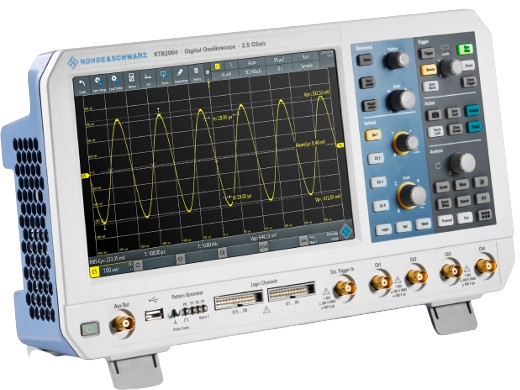
</div>

- ***Configuración de la forma de onda:***
  Las opciones que tiene este osciloscopio para configurar la forma de onda de las señales de entrada y salida son muchas, permitiendo así un mejor tratamiento según el análisis necesario. En su manual, explican desde cómo conectar y configurar sondas, hasta ajustar la configuración horizontal y vertical de las señales, y controlar la adquisición.

- ***Configuración del trigger:***
  Esta opción va muy de la mano con la anterior especificación, puesto que gracias al ‘trigger’, se pueden capturar partes de interés de las formas de onda para lograr así una obtención de datos más precisa.

- ***Análisis de la forma de onda:***
  Dentro de este apartado presentado en el manual, la especificación que más resalta es el zoom, ya que como su nombre lo infiere, amplía una parte de la forma de onda para conocer más detalles. Las formas de onda se muestran con una escala de tiempo más corta mientras que la escala vertical permanece sin cambios.

- ***Medidas:***
  Este osciloscopio proporciona muchos tipos de medidas para conocer características de tiempo y amplitud, y para contar pulsos y flancos. Por ejemplo: la frecuencia, ciclos de trabajo, top level, entre otros. Dichas mediciones se muestran en una línea debajo de la cuadrícula.

- ***Diseño de la pantalla:***
  En cuanto a algo diferente a las facilidades ya platicadas anteriormente de este osciloscopio, es innegable la comodidad del uso de su pantalla táctil y buena calidad, a comparación de otros osciloscopios que poseen los laboratorios de la Escuela de E3T en la UIS. Se puede mostrar más datos de interés en las señales tratadas.

**2.	Analizador de espectros R&S FPC1000**

| 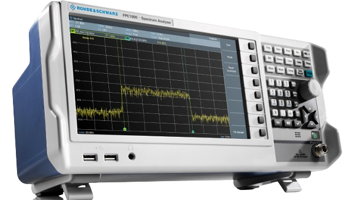 | 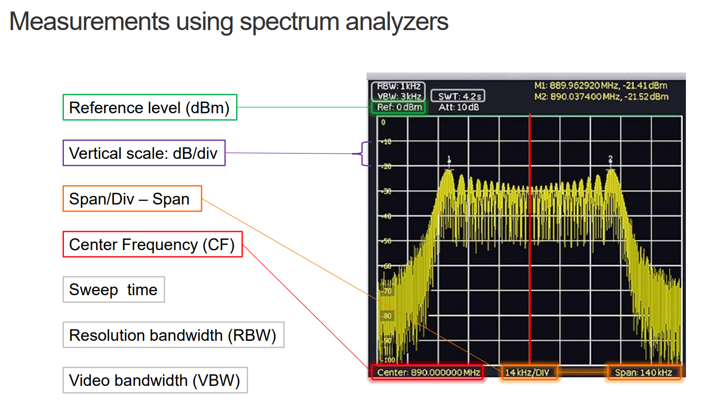 |
|:---:|:---:|
| **Spectrum Analyzer** | **Diapositiva** |
  
  - ***Aplicación del analizador de espectro:***
  Junto con las mediciones básicas de frecuencia y dominio temporal, también se incorporan diversas mediciones avanzadas, como la del ancho de banda ocupado (OBW). Asimismo, se dispone de una amplia variedad de configuraciones y herramientas para ajustar y analizar mediciones espectrales.

  - ***Aplicación del receptor de espectro:***
  La aplicación del receptor mide el nivel de potencia de una frecuencia específica o de un conjunto de frecuencias personalizado.

  - ***Demodulación analógica:***
  Se demodulan señales moduladas en amplitud (AM) y frecuencia (FM), y muestra algunos aspectos de la señal modulada y demodulada.

  - ***Demodulación digital:***
  Se demodulan señales moduladas con esquemas de modulación por desplazamiento de amplitud (ASK) y de frecuencia (FSK), y muestra algunos aspectos de la señal modulada y demodulada.

 - ***Diseño de la pantalla:***
  Similar a lo explicado con el osciloscopio, es importante resaltar también la importancia del diseño y distribución de los datos de interés en las señales tratadas en la pantalla.

**3.	Radio USRP 2920**
<div style="text-align: center;">
    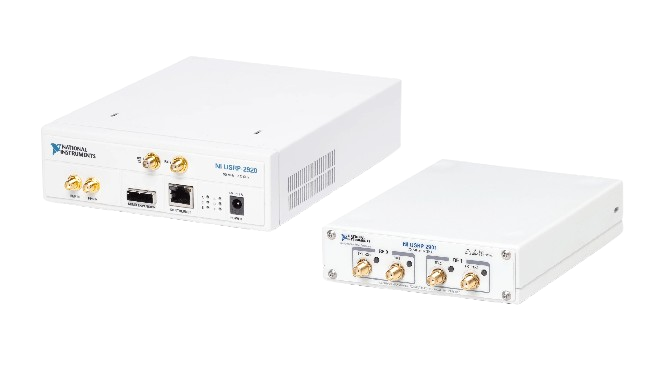
</div>

- ***Rango de frecuencia (frequency range):***
Se trata del rango de frecuencias por el cual el radio puede transmitir o recibir señales. Tanto para el transmisor como el receptor, dicho rango es de 50[M*Hz*] a 2.2 [G*Hz*].

- ***Potencia máxima de salida (Pout)***
Indica el nivel máximo de potencia que puede emitir el transmisor, lo cual es importante para garantizar que la señal pueda llegar al destino previsto con suficiente fuerza. Posee dos rangos: 50 [M*Hz*] a 1.2 [G*Hz*], para 50 [m*W*] a 100 [m*W*] (17 [dBm] a 20 [dBm]) y 1.2 [G*Hz*] a 2.2 [G*Hz*], para 30 [m*W*] a 70 [m*W*] (15 [dBm] a 18 [dBm]).

- ***Rango de ganancia***
Es fundamental para ajustar la intensidad de la señal a niveles óptimos, garantizando una comunicación clara y confiable entre el transmisor y el receptor. Para el primero, dicho rango es de 0 [dB] a 31 [dB], y el segundo, de 0 [dB] a 31.5 [dB].

-	***Ancho de banda máximo instantáneo en tiempo real***
Especifica el ancho de banda máximo que el dispositivo puede manejar en tiempo real, lo que es esencial para aplicaciones que requieren altas velocidades de datos o señales de banda ancha. Para un ancho de muestra de 16 bits, el ancho de banda máximo es de 20 [MHz] y para uno de 8 bits, de 40[MHz].

-	***Precisión de la frecuencia***
Se utiliza para garantizar que las señales transmitidas y recibidas estén exactamente en la frecuencia prevista. Tanto para el transmisor como el receptor, dicho valor es de 2.5 [ppm].

Entre medir una señal en el dominio del tiempo (vista con el osciloscopio) y en el dominio de la frecuencia (vista con el analizador de espectros),evidentemente, se tienen dos diferentes formas de visualizar lo que son los parámetros de la señal, como lo son la potencia y la frecuencia de la señal. Se puede observar que en el espectro la información se encuentra más condensada, lo que permite recuperar parte de esa información con menores pérdidas.

| 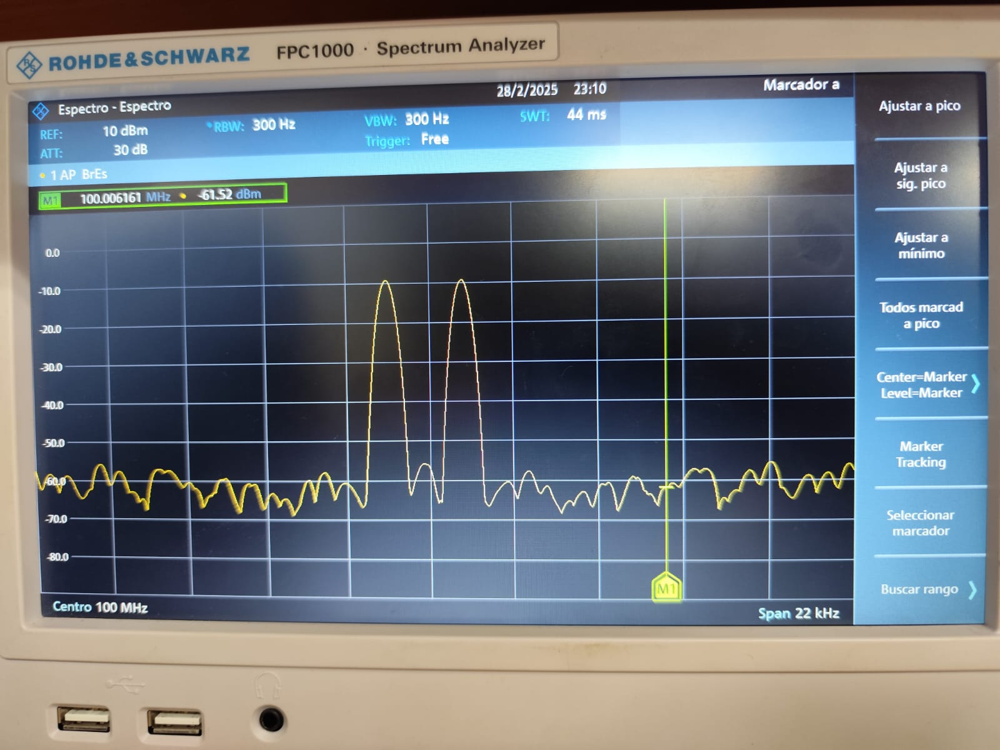 | 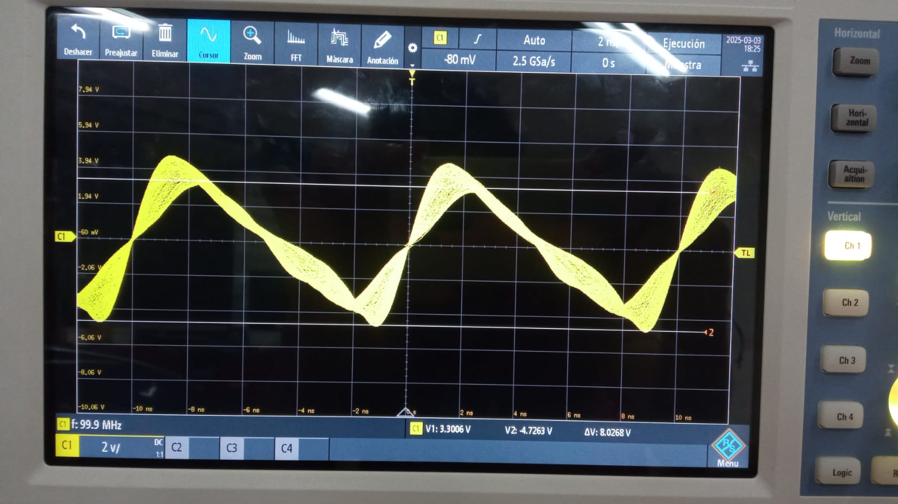 |
|:---:|:---:|
| **Analizador de espectro** | **Osciloscopio** |

Teniendo en cuenta las especificaciones anteriores, se procedió a hallar la 
potencia de ruido ($P_N$) y calcular el piso de ruido normalizado ($NF$):

<div style="text-align: center;">
    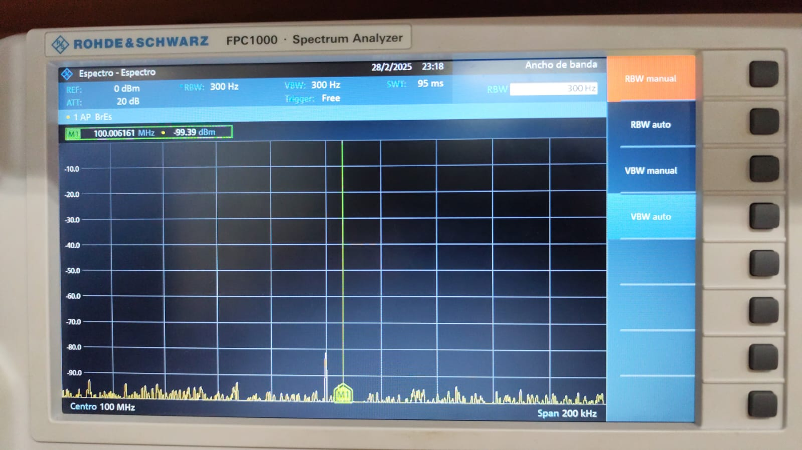
</div>

Donde se puede observar que:

  $RBW = 300[Hz]$

  $P_Nref ≈ -100[dBm]$

A continuación, se realiza el cálculo del piso de ruido:

  $NF[dBm/Hz]  = P_Nref[dBm] - 10 log(\frac{RBW}{1 [Hz]})$

  $NF = -100-10log(\frac{300}{1})$

  $NF = -124,771 [dBm/Hz]$


#### Actividad 2: Simulación de Señales en GNU Radio


Comprender las bases de cómo procesa las señales un software como GNU Radio es fundamental para trazar un margen claro entre la teoría y lo que podemos observar en una simulación. En este contexto, exploraremos los bloques principales de un esquema de diseño del siguiente [flujograma](1.Flujo_grama/simple_flowgraph.grc):


- **Signal Source:** Define los  parametros de la señal como el muestreo tanto en tiempo como frecuencia , la forma de onda, la frecuencia, la amplitud, el offset, la fase y el tipo de dato.
- **Throttle:**  Regula la tasa de muestreo de la señal para evitar que el simulador consuma demasiados recursos del sistema.
- **QT GUI Time Sink:** Define el numero de puntos que representan la señal en el dominio del tiempo.
- **QT GUI Frequency Sink:** Responsable de realizar el cambio de dominio del tiempo a el dominio de la frecuencia,definir el ancho de banda de la respuesta en frecuencia y permitirnos visualizar la magnitud en el espectro.

Los tipos de señales "análogas" en el sistema son reales ***(float)*** y complejas ***(complex)*** donde para generar la componente compleja hace uso ***Filtro de Hilbert*** [[1]](#bibliografía) , [[2]](#bibliografía)

<div style="text-align: center;">
    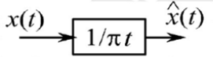
</div>

Donde $\hat{x}(t)$ es la Transformada de Hilbert de $x(t)$.

  <div style="text-align: center;">
    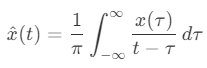
</div>

 La Transformada de Hilbert introduce un **desfase de $-90^\circ$** para las frecuencias positivas y un **desfase de $+90^\circ$** para las frecuencias negativas.

**Transformada de Hilbert como filtro:**
- Respuesta al impulso:

  $x(t) = \frac{1}{\pi t}$


- Respuesta en frecuencia:
<div style="text-align: center;">
    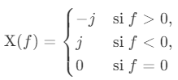
</div>


##### Preguntas Orientadoras Actividad 2 //responder , no colocar xd

- [x] 1. ¿Cómo se puede explicar matemáticamente la diferencia entre una fuente de tipo flotante y una de tipo complejo?
- [ ] 2. ¿Cómo afecta la forma de onda a la distribución de energía (potencia) en el dominio de la frecuencia?
- [ ] 3. ¿Qué sucede con la señal en el dominio del tiempo y la frecuencia si se modifican los diferentes parámetros de la fuente? ¿Lo observado corresponde a lo esperado teóricamente?
- [ ] 4. ¿Cómo se relaciona la amplitud de la señal con la potencia observada en el dominio de la frecuencia?
- [ ] 5. ¿Qué diferencias se observan entre una señal senoidal y una señal cuadrada en el dominio de la frecuencia?

#### Actividad 3: Transmisión y Medición de Señales con el USRP 2920


Lo primero que se debe hacer es configurar en GNU Radio el flujograma otorgado en la guía del informe para transmitir una señal a través del radio USRP 2920, deshabilitándose los bloques Channel Model, Throttle, UHD: USRP Sink, Virtual Sink. Después, se edita el valor de la frecuencia según se requiera en el bloque de frecuencia de muestreo (samp_rate). En cuanto al entorno físico, se debe conectar un cable ethernet para establecer la comunicación entre GNU Radio y el USRP, y para visualizar la señal, se conecta otro cable desde la terminal TX1 del USRP al analizador de espectro. Dentro del flujograma se puede encontrar uno de los parámetros clave que afectan la potencia de la señal transmitida. Se trata del bloque QT GUI Range, el cual permite variar la amplitud de la señal en tiempo real. Este ajuste influye directamente en la potencia de transmisión, lo que se refleja en la visualización de la señal en el analizador de espectro.

Las medidas de interés para el presente laboratorio son parámetros clave como potencia, ancho de banda, piso de ruido y relación señal a ruido (SNR). Para medir el ancho de banda de la señal transmitida, se utilizan marcadores en el analizador de espectro. El Marcador 1 se coloca en el pico de la señal, mientras que los Marcadores 2 y 3 se ubican en los puntos donde la amplitud disminuye 3[dB] a cada lado respecto al pico, y es la diferencia en frecuencia entre estos dos puntos lo define el ancho de banda de la señal. Otro parámetro importante es la relación señal a ruido (SNR), la cual se calcula a partir de las mediciones de potencia de la señal y del ruido obtenidas con los marcadores del analizador de espectro. Haciendo uso de la fórmula:

$SNR_{[dB]} = 10 \log_{10} \left( \frac{P_S{[W]} }{P_N{[W]} } \right)$

$SNR_{[dB]} = P_S {[dB]} - P_N {[dB]} $

Donde $P_S$ es la potencia de la señal y $P_N$ la potencia de ruido, se determina la calidad de la señal en términos de su nivel respecto al ruido presente. Este cálculo es fundamental para evaluar el desempeño del sistema de transmisión y garantizar que la señal sea lo suficientemente robusta para su recepción.

#### Caso 1. Señal constante

| 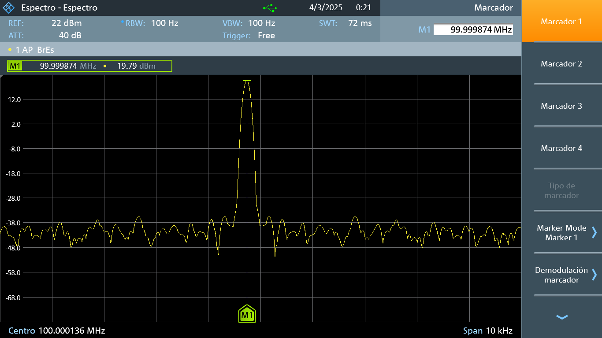 | 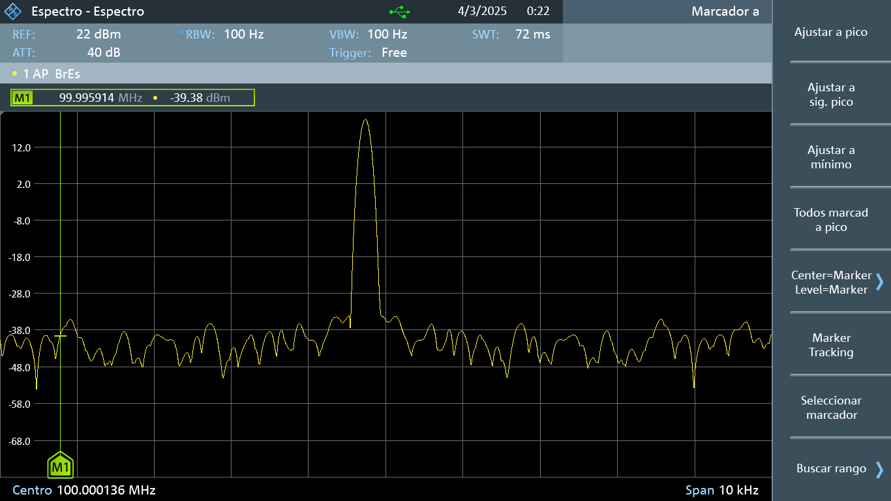|
|:---:|:---:|
| **Potencia de la señal** | **Potencia de ruido** |

$SNR_{[dB]} = 19.79[dB] - (-39.38) [dB]$

$SNR_{[dB]} = 59.17[dB]$

#### Caso 2. Señal ventana

| 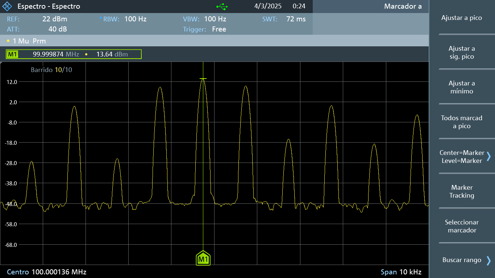 | 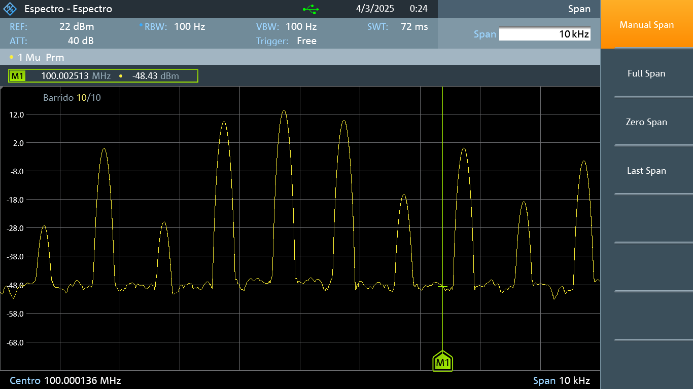|
|:---:|:---:|
| **Potencia de la señal** | **Potencia de ruido** |

#### Caso 3. Señal cosenoidal tipo complejo

| 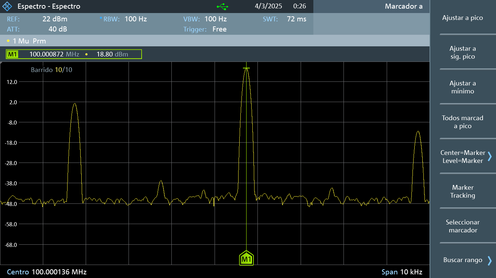 | 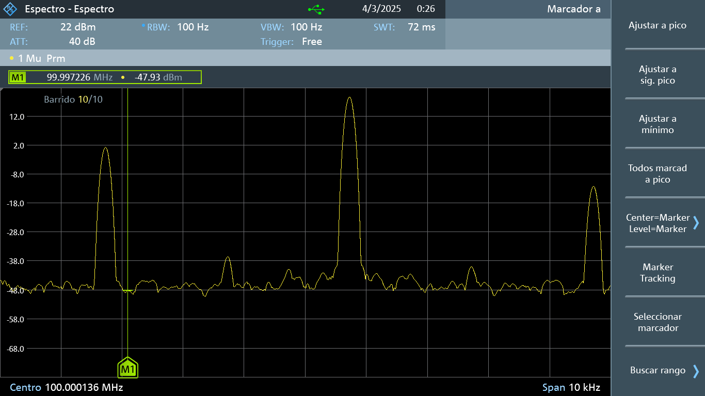 |
|:---:|:---:|
| **Potencia de la señal** | **Potencia de ruido** |


Finalmente, fue posible estimar algunas de estas características utilizando un osciloscopio, ya que este instrumento permite visualizar la amplitud de la señal en el dominio del tiempo, parámetro que también es de utilidad para calcular la potencia.


##### Preguntas Orientadoras Actividad 3 //responder , no colocar xd

- [x] 1. ¿Cómo se configura el USRP 2920 para transmitir una señal en una frecuencia específica?
- [x] 2. ¿Qué parámetros del flujograma afectan la potencia de la señal transmitida?
- [x] 3. ¿Cómo se mide el ancho de banda de la señal transmitida en el analizador de espectros?
- [x] 4. ¿Cómo se calcula la relación señal a ruido (SNR) a partir de las mediciones de potencia y piso de ruido?
- [ ] 5.¿Qué diferencias se observan en las mediciones de potencia cuando se varía la ganancia del USRP?
- [x] 6. ¿Es posible medir o estimar la potencia de la señal observada en el osciloscopio? ¿Por qué?  

#### Actividad 4: Análisis de Resultados y Conclusiones
##### Preguntas Orientadoras Actividad 4 //responder , no colocar xd
- [x] 1. ¿Qué conclusiones se pueden obtener sobre la relación entre la potencia de la señal y la calidad de la comunicación?
- [x] 2. ¿Cómo afecta el piso de ruido a la capacidad de detectar señales débiles?
- [x] 3. ¿Qué limitaciones tienen los equipos utilizados en términos de ancho de banda y precisión en las mediciones?
- [x] 4. ¿Cómo se pueden mejorar las mediciones de señal en un entorno con alto nivel de ruido?
- [x] 5. ¿Qué aplicaciones prácticas tienen las mediciones de potencia y ancho de banda en sistemas de comunicaciones reales?
- [ ] 6. ¿Cómo se puede medir la respuesta en frecuencia de un canal alámbrico?
- [ ] 7. ¿Cómo se puede obtener un modelo sencillo de las pérdidas (_pathloss_) en un canal inalámbrico?
---
## Conclusiones

  - La potencia de la señal es un factor clave en la calidad de la comunicación, pero no es el único elemento determinante. Para lograr una comunicación efectiva, es necesario equilibrar la potencia con aspectos como las interferencias causadas por el mal estado del medio de transmisión o la saturación de la señal debido a una potencia excesiva. En ese sentido, el piso de ruido juega un papel crucial, ya que establece el límite mínimo (inferior) para la detección de señales. Una señal solo puede ser identificada si su potencia supera este umbral, de lo contrario, se confunde con el ruido propio del ambiente. Si la señal es muy débil y se aproxima al piso de ruido, la relación señal-ruido será baja, dificultando su detección. Para solucionar este problema, se pueden emplear receptores con mayor sensibilidad o técnicas de mejora que permitan distinguir la señal del ruido, lo que resalta la importancia de considerar tanto el entorno como las capacidades de los equipos utilizados.
  
 - Las limitaciones de los equipos, como el ancho de banda ya mencionado anteriormente del radio USRP 2920, impone restricciones en la cantidad de información que puede transmitirse o recibirse por unidad de tiempo y la imposibilidad de que este radio sea de utilidad en aplicaciones de banda ancha. Además, en entornos con alto nivel de ruido, las mediciones de una señal pueden mejorarse mediante el uso de filtros adaptados a las necesidades específicas y, en algunos casos, implementando blindajes para proteger la señal del ruido externo. Estas estrategias son esenciales para garantizar la precisión y fiabilidad de las mediciones en condiciones adversas para diferentes aplicaciones reales. Un ejemplo cotidiano es la radio FM, que opera en un ancho de banda de 87.5[MHz] a 108 [MHz], o incluso la radioastronomía, que abarca desde 300[MHz] hasta 300[GHz], dividiéndose en bandas como UHF, SHF y EHF. Estas aplicaciones ilustran la relevancia de comprender y optimizar estos parámetros para el funcionamiento eficiente de sistemas de comunicación en diferentes contextos. 


---
## Referencias

### Bibliografía

- [Proakis, 2014] J. Proakis, M. Salehi. Fundamentals of communication systems. 2 ed. England: Pearson Education Limited, 2014. p. 95-100,132. Chapter 2.6 In: [Biblioteca UIS](https://uis.primo.exlibrisgroup.com/permalink/57UIDS_INST/63p0of/cdi_askewsholts_vlebooks_9781292015699)

- [R&S, 2017] Rohde & Schwarz GmbH & Co. R&S®RTB2000 Digital Oscilloscope User Manual. 2017. p. 34-108.[Abrir documento en el repositorio][Abrir manual del osciloscopio](../Equipos_de_laboratorio/Oscilloscope_RTB_UserManual_en.pdf).

- [R&S, 2017] Rohde & Schwarz GmbH & Co. R&S®FPC1000 Spectrum Analyzer User Manual. 2017. p. 36-148.[Abrir manual del Analizador de espectros](../Equipos_de_laboratorio/Spectrum_Analyzer_FPC_XXX_ANL-EN.pdf)

- [NI, 2025] NATIONAL INSTRUMENTS CORP. USRP-2920 Specifications. 2025. p. 3-148.[Abrir manual del Radio](../Equipos_de_laboratorio/usrp-2920_specifications.pdf)


### Recursos Digitales
- Wikipedia. (s.f.). *Transformada de Hilbert*. Recuperado de https://es.wikipedia.org/wiki/Transformada_de_Hilbert  
- Academia Lab. (s.f.). *Transformada de Hilbert*. Recuperado de https://academia-lab.com/enciclopedia/transformada-de-hilbert/  
- Reyes, Ó. (s.f.). *COMMUNICATION SYSTEMS. Lesson 1-3: The dB in Communications*. Recuperado de https://lms.uis.edu.co/ava/pluginfile.php/271940/mod_folder/content/0/Lesson_1_3_The_dB_in_communications.pdf
- NATIONAL INSTRUMENTS CORP. (2015). *How to Measure the Noise Floor of Your Signal Analyzer*. Recuperado de https://www.youtube.com/watch?v=ujce9AzrqdY


### Artículos de Interés

- Carrick, J. (2011). *Design and Application of a Hilbert Transformer in a Digital Receiver*. [Abrir documento en el repositorio](7.ANEXOS/DESIGN_AND_APPLICATION_OF_A_HILBERT_TRANSFORMER_IN_A_DIGITAL_RECEIVER.pdf).  
- Hasegawa, T., & Sugiura, H. (2022). *Filtered Integration Rules for Finite Weighted Hilbert Transforms*. [Abrir documento en el repositorio](7.ANEXOS/Filtered_integration_rules_for_finite_weighted_Hilbert.pdf).  
  
---

# Ejemplos usando Markdown

Volver al [INICIO](#laboratorio-de-comunicaciones)

## Inclusión de Imágenes

### Imagen de referencia dentro del repositorio


### Imagen de fuente externa


### Uso de html para cambiar escala de la imagen


## Creación de hipevínculos

- [Aprende Markdown](https://markdown.es/)
- [Más acerca de Markdown](https://docs.github.com/en/get-started/writing-on-github/getting-started-with-writing-and-formatting-on-github/basic-writing-and-formatting-syntax)
- [Abrir documento en el repositorio](my%20file/test_file.txt). Si hay espacios en la ruta de su archivo, reemplácelos por `%20`.
- Ir a una sección de este documento. Por ejemplo: [Ir a Contenido](#contenido) Tenga en cuenta escribir el título de la sección en minúsculas y los espacios reemplazarlos por guiones.

## Uso de Expresiones Matemáticas

Se pueden incluir ecuaciones en el archivo `README.md` utilizando sintaxis similar a [LaTeX](https://manualdelatex.com/tutoriales/ecuaciones):

### Ecuaciones en Línea

```
La energía de una señal exponencial es $E = \int_0^\infty A^2 e^{-2t/\tau} dt$.
```

**Salida renderizada:**
La energía de una señal exponencial es $E = \int_0^\infty A^2 e^{-2t/\tau} dt$.

### Ecuaciones en Bloque

```
$$E = \int_0^\infty A^2 e^{-2t/\tau} dt = \frac{A^2 \tau}{2}$$
```

**Salida renderizada**
$$E = \int_0^\infty A^2 e^{-2t/\tau} dt = \frac{A^2 \tau}{2}$$

## Creación de Tablas

**Tabla 1.** Ejemplo de tabla en Markdown.

| Parámetro | Valor |
|-----------|-------|
| Frecuencia (Hz) | 1000 |
| Amplitud (V) | 5 |
| Ciclo útil (%) | 50 |

## Inclusión de código

```python
def hello_world():
    print("Hello, World!")
```

También es posible resaltar texto tipo código como `print("Hello, World!")`.

---

Volver al [INICIO](#laboratorio-de-comunicaciones)
